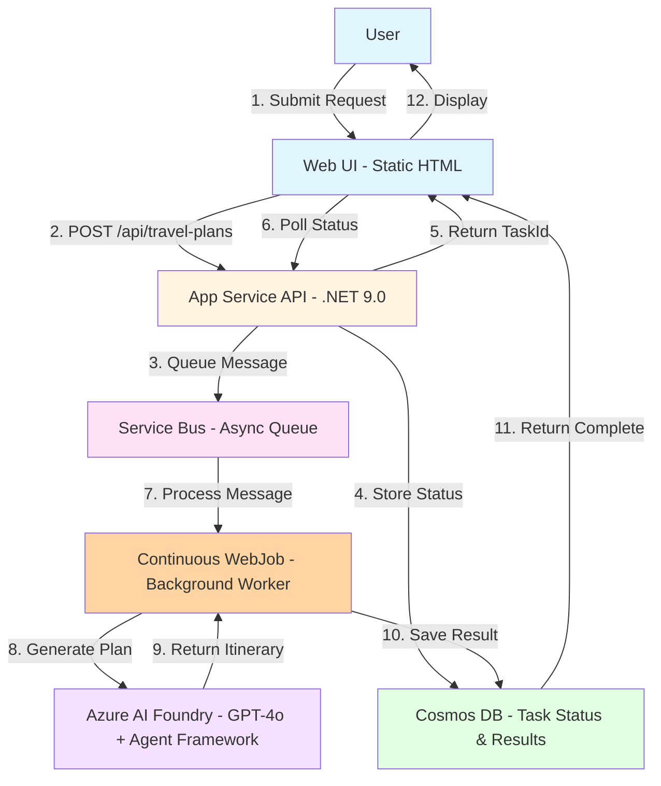

# Travel Planner Architecture

## High-Level System Overview

## How It Works

### 1. **User Submits Travel Request**
User fills out form with destination, dates, budget, interests, and preferences.

### 2. **API Creates Async Task**
- API creates task in Cosmos DB with status "queued"
- Sends message to Service Bus queue
- Returns taskId immediately (non-blocking)

### 3. **Background Processing**
- Continuous WebJob picks up message from queue
- Updates task status to "processing"
- Calls Azure AI Foundry to generate itinerary

### 4. **AI Agent Generation**
- WebJob creates persistent AI agent with GPT-4o
- Runs agent with travel instructions and user preferences
- Agent generates detailed itinerary with activities, costs, tips

### 5. **Store and Return Results**
- Parses AI response and extracts travel tips
- Updates Cosmos DB with completed itinerary
- Task status changes to "completed"

### 6. **UI Polling and Display**
- UI polls API every second for status updates
- Shows progress bar during processing
- Displays formatted itinerary when complete

## Key Architecture Patterns

### ✅ Async Request-Reply Pattern
- API returns immediately with taskId
- Client polls for status updates
- No long-running HTTP connections

### ✅ Background Processing with WebJobs
- Continuous WebJob runs as separate process on App Service
- Service Bus decouples API from heavy AI work
- Enables independent restarts and monitoring
- Retry logic for reliability

### ✅ Azure AI Agent Framework
- Server-side persistent agents with threads
- Managed lifecycle (create → run → delete)
- Conversation context via threads

### ✅ Managed Identity
- No credentials in code
- Secure authentication to all Azure services

### ✅ State Management
- Cosmos DB stores all task state
- 24-hour TTL for automatic cleanup

## Key Features

### WebJob Architecture
- **Separate Process**: WebJob runs independently from the API
- **Independent Restart**: Restart WebJob without affecting API
- **Dedicated Logging**: WebJob logs separate from API logs in Azure Portal
- **Single Instance**: WEBJOBS_RUN_ONCE prevents duplicate message processing
- **Continuous Execution**: Always-on WebJob for immediate message processing

### Asynchronous Processing
- **Request-Reply Pattern**: Client submits request → receives taskId → polls for status
- **Background Processing**: Service Bus ensures reliable async execution
- **Progress Tracking**: Real-time status updates (queued → processing → completed)

### Azure AI Agent Framework
- **Persistent Agents**: Server-side agents with threads and runs
- **Managed Lifecycle**: Agents created per request and cleaned up after use
- **Conversation Context**: Thread-based conversation management
- **AI Orchestration**: GPT-4o model with custom instructions

### State Management
- **Cosmos DB**: Centralized state storage with TTL for auto-cleanup
- **Task Status**: Tracks progress and stores results
- **24-Hour TTL**: Automatic cleanup of old travel plans

### Scalability
- **Premium App Service**: P0v4 Windows tier for production workloads
- **Service Bus**: Decouples API from processing for horizontal scaling
- **Managed Identity**: Secure, credential-less authentication
- **WebJob Worker**: Dedicated process for heavy AI processing

### Reliability
- **Retry Logic**: Service Bus max 3 delivery attempts
- **Dead Letter Queue**: Failed messages moved to DLQ after max retries
- **Error Handling**: Comprehensive try-catch with logging
- **Status Tracking**: Detailed progress and error messages
- **Duplicate Prevention**: WebJob checks if task already completed before reprocessing
- **Cleanup**: Automatic agent deletion and 24-hour document expiration
